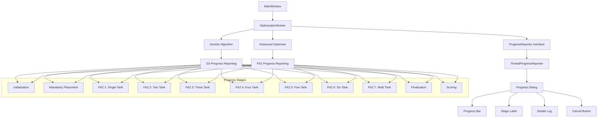
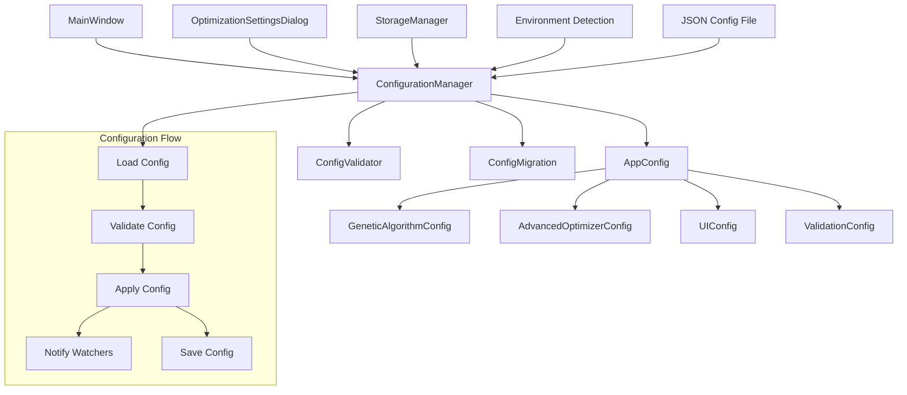
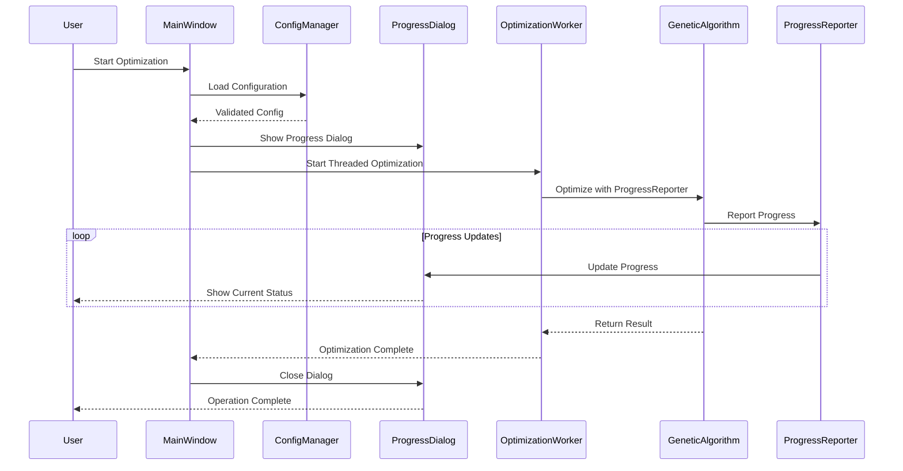
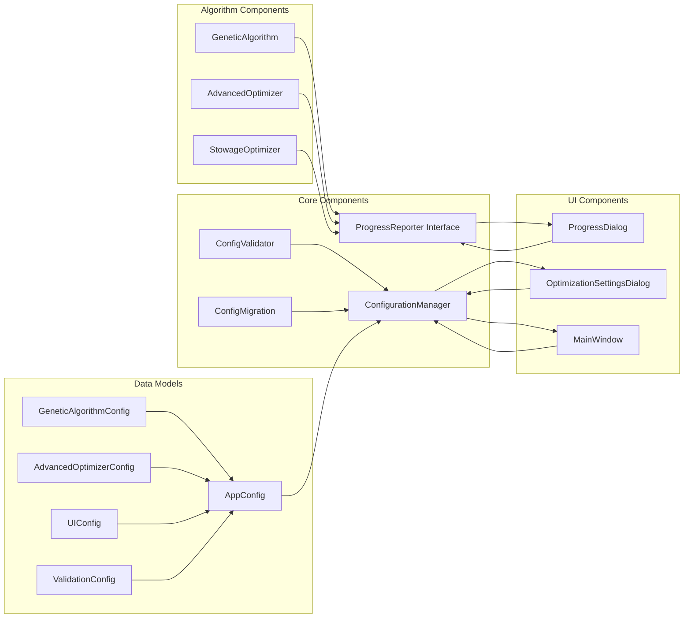
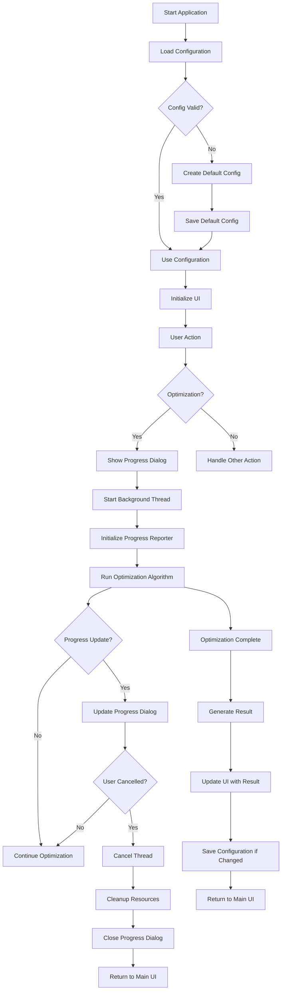
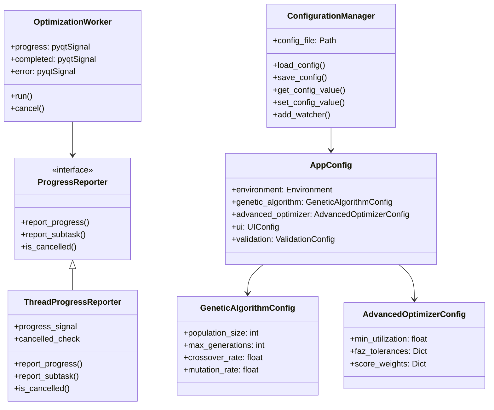

# Architecture Diagrams

## Progress Indicator Architecture

## Configuration Management Architecture

## Integration Flow Diagram

## Component Relationship Diagram

## File Structure Diagram

```mermaid
graph TD
    A[Project Root] --> B[core/]
    A --> C[ui/]
    A --> D[optimizer/]
    A --> E[storage/]
    A --> F[models/]
    A --> G[utils/]
    A --> H[tests/]
    A --> I[docs/]
    
    B --> J[progress_reporter.py]
    B --> K[config_manager.py]
    B --> L[config_models.py]
    B --> M[config_validator.py]
    B --> N[config_migration.py]
    B --> O[optimization_worker.py]
    B --> P[thread_progress_reporter.py]
    
    C --> Q[progress_dialog.py]
    C --> R[main_window.py - Modified]
    C --> S[optimization_settings_dialog.py - Modified]
    
    D --> T[genetic_optimizer.py - Modified]
    D --> U[advanced_optimizer.py - Modified]
    D --> V[stowage_optimizer.py - Modified]
    
    E --> W[storage_manager.py - Modified]
    
    H --> X[test_config_manager.py]
    H --> Y[test_progress_reporter.py]
    H --> Z[test_optimization_worker.py]
    H --> AA[test_integration.py]
    
    I --> BB[progress_indicator_design.md]
    I --> CC[configuration_management_design.md]
    I --> DD[implementation_plan.md]
    I --> EE[improvements_summary.md]
    I --> FF[architecture_diagram.md]
```

## Data Flow Diagram

## Class Hierarchy Diagram

These diagrams illustrate the complete architecture for the proposed improvements, showing the relationships between components, data flow, and integration points.